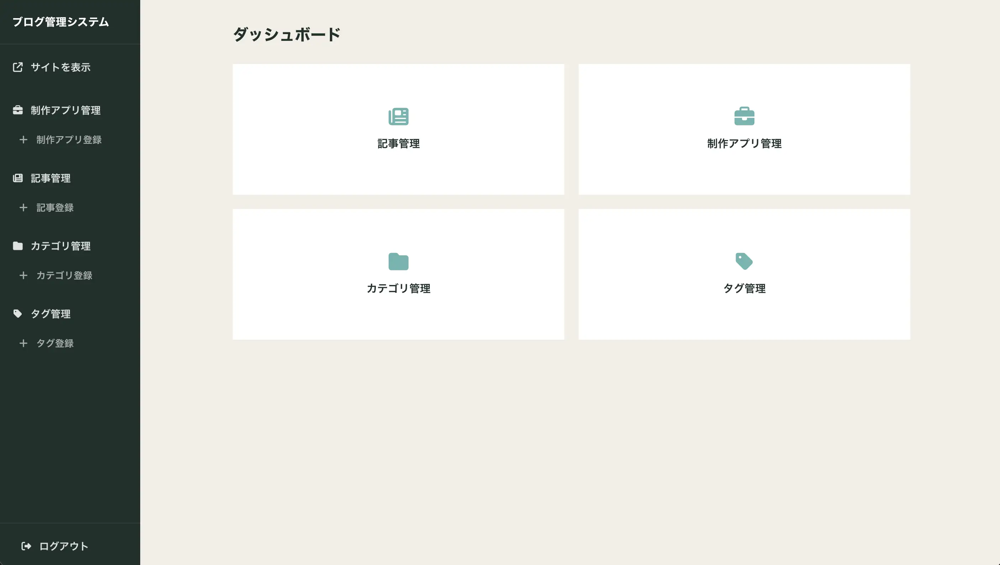
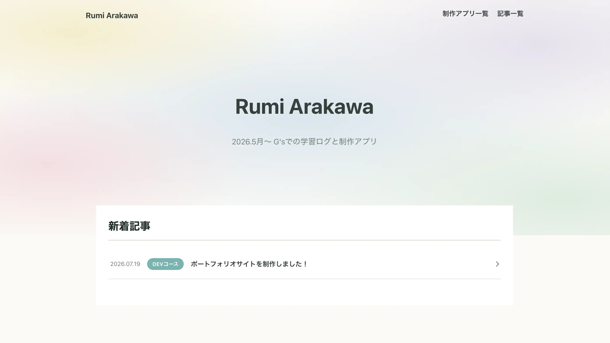

# ①課題名

ポートフォリオ・ブログ管理システム

## ②課題内容（どんな作品か）

- 管理画面から、ブログ記事(posts)と制作アプリ(works)をカテゴリ・タグ付きでCRUD管理できるシステムです。
- 同じテーブルから管理画面側と公開ページ側それぞれを出し分け、公開ページ側ではstatus = publishedのものだけを表示させるようにしました。
- GitHub REST APIと連携し、自分のリポジトリ群の使用言語比率を公開ページのトップに表示する機能を追加しました。

## ③アプリのデプロイURL

管理画面 
https://gs2026-arakawa.sakura.ne.jp/kadai09_auth/admin/login.php

公開ページ 
https://gs2026-arakawa.sakura.ne.jp/kadai09_auth/public/index.php

## ④アプリのログイン用IDまたはPassword（ある場合）

- ユーザー名：admin
- パスワード：mypassword03

## ⑤工夫した点・こだわった点

- サムネイル・ギャラリー画像の差し替え・削除時に、古い画像ファイルをサーバーからも削除し、不要なファイルが残らないようにしました。
- GitHub APIの取得結果をDBにキャッシュする設計にしました。一定時間はAPIを叩かずキャッシュから表示、API・DB側で失敗した場合も古いキャッシュにフォールバックして画面が壊れないようにしています。

## ⑥難しかった点・次回トライしたいこと（又は機能）

画像のアップロードを初めて扱ったのですが、テキストの保存とは違う難しさがありました。拡張子のチェックとサイズ制限(2MB)を自前で用意する必要があったり、画像を差し替え・削除した際にサーバー上の古いファイルを削除する処理を書いたりと、テキスト項目のCRUDに比べて考慮すべき内容が多く難しかったです。

## ⑦フリー項目（感想、シェアしたいこと等なんでも）

今後、自分の転職活動のために使えるポートフォリオサイトを自作しました。
まだ内容が不十分なため、今後、実用で使えるように機能面でも内容面でもブラッシュアップしていきたいです。
